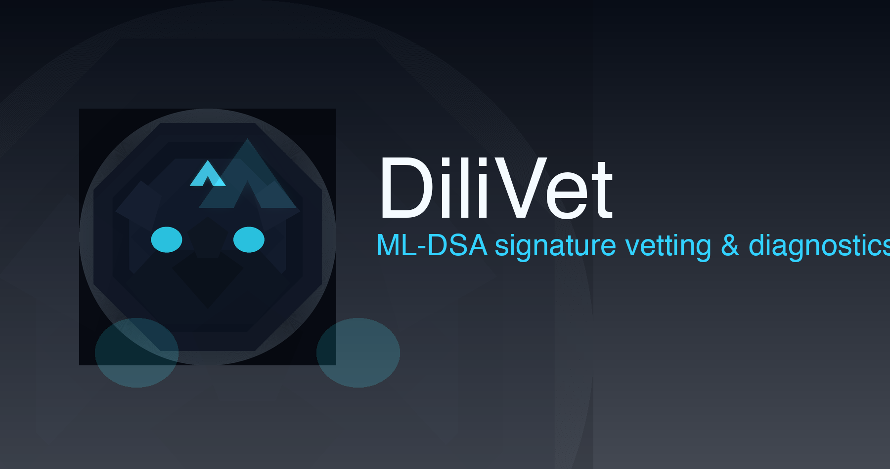

<!--
DiliVet – ML-DSA diagnostics and vetting toolkit
Author: Thor "Thor Thor" (codethor@gmail.com, https://www.linkedin.com/in/thor-thor0)
-->



<p align="center">
  
</p>

# DiliVet

[](https://goreportcard.com/report/github.com/codethor0/dilivet)
[](https://pkg.go.dev/github.com/codethor0/dilivet)
[](https://github.com/codethor0/dilivet/actions/workflows/ci.yml)
[](https://github.com/codethor0/dilivet/actions/workflows/fuzz.yml)
[](https://github.com/codethor0/dilivet/actions/workflows/release.yml)
[](https://securityscorecards.dev/viewer/?uri=github.com/codethor0/dilivet)
[](./LICENSE)

## About

DiliVet is a diagnostics and vetting toolkit for ML-DSA (Dilithium-like) signature implementations. It focuses on reproducible known-answer testing, adversarial edge vectors, and deterministic sampling so implementers can catch integration bugs before shipping. The CLI also exposes interoperability helpers for exercising third-party signers and verifiers, plus reproducible release artifacts with cosign and SLSA provenance to keep the supply chain transparent.

## Quick start

Install the primary CLI and verify the binary:

```bash
go install github.com/codethor0/dilivet/cmd/dilivet@latest
dilivet -version
```

Alternative/alias CLI:

```bash
go install github.com/codethor0/dilivet/cmd/mldsa-vet@latest
mldsa-vet -version
```

Verify a signature (public key and signature files hex-encoded by default):

```bash
dilivet verify -pub path/to/pk.hex -sig path/to/sig.hex -msg path/to/message.bin
```

Run structural checks against the bundled ACVP sigVer vectors:

```bash
dilivet kat-verify
```

Verify downloaded release artifacts (when using release zips):

```bash
# Example: check matching SHA256 in SHA256SUMS.txt
# GOOS="$(uname -s | tr 'A-Z' 'a-z')"
# GOARCH="$(uname -m | sed 's/aarch64/arm64/;s/x86_64/amd64/')"
# grep -E "(dilivet|mldsa-vet)-${GOOS}-${GOARCH}\.zip" SHA256SUMS.txt | shasum -a 256 -c
```

## Quickstart (3 commands)

```bash
go install github.com/codethor0/dilivet/cmd/dilivet@latest
dilivet -version
printf 'msg=616263\npk=00\nsk=ff\nend\n' > sample.req && dilivet kat -req sample.req -mode verify
```

## Verify releases (cosign + SLSA)

```bash
# Verify the checksum bundle (requires cosign v2.0+)
COSIGN_EXPERIMENTAL=1 cosign verify-blob \
  --bundle dist/SHA256SUMS.txt.bundle \
  --certificate-identity-regexp 'https://github.com/codethor0/dilivet' \
  --certificate-oidc-issuer https://token.actions.githubusercontent.com \
  dist/SHA256SUMS.txt

# Verify provenance (requires slsa-verifier)
slsa-verifier verify-artifact \
  --provenance dist/provenance.intoto.jsonl \
  --source-uri github.com/codethor0/dilivet \
  dist/dilivet_<os>_<arch>.tar.gz
```

## Interop: external implementations

```bash
# Run an external signer (Rust) and verifier (Python) against a message/key pair
dilivet exec \
  --sign ./target/release/my-mldsa-signer \
  --verify ./venv/bin/my-mldsa-verifier \
  --msg 626f726e73757072656d616379 \
  --pk deadbeefcafebabe \
  --sk 0badf00dbadc0ffe
```

## Run CI locally

Reproduce CI checks locally to catch issues before pushing:

```bash
# Install Go 1.24.x (or use asdf/nvm-style version manager)
go version  # Should show go1.24.x

# Fast preflight (lint + types) - runs on PRs
go vet ./...
golangci-lint run --timeout=5m

# Full test suite (matches CI matrix)
go test -race -p 4 ./...

# Fuzz tests (optional, matches CI)
go test -fuzz=FuzzDecodePublicKey -fuzztime=1m ./fuzz
go test -fuzz=FuzzVerify -fuzztime=1m ./fuzz

# Cross-compile build test (matches release workflow)
for os in linux darwin windows; do
  for arch in amd64 arm64; do
    CGO_ENABLED=0 GOOS=$os GOARCH=$arch \
      go build -trimpath -ldflags "-s -w" \
      -o "dist/dilivet-$os-$arch" ./cmd/dilivet
  done
done
```

**Cache strategy**: CI caches Go modules and build cache using keys based on `go.sum` hash. Local cache locations:
- Build cache: `~/.cache/go-build` (or `$GOCACHE`)
- Module cache: `~/go/pkg/mod` (or `$GOMODCACHE`)

**Parallelism**: Tests run with `-p 4` to utilize available CPU cores. Adjust based on your machine.

**Path filters**: CI only runs on PRs when Go files, `go.mod`, `go.sum`, or workflow files change. Push to `main` always triggers full runs.

## Web UI

DiliVet includes a web interface for running diagnostics from a browser. See [docs/WEB_UI.md](docs/WEB_UI.md) for details.

**Quick start:**

```bash
# Start the backend server
go run ./web/server

# In another terminal, start the frontend dev server
cd web/ui && npm install && npm run dev
```

The web UI provides:
- Signature verification with a user-friendly form
- KAT (known-answer test) verification with detailed results
- Dashboard with server health status

**Note:** The web UI is diagnostics tooling and should be used in controlled environments only. It is not hardened for untrusted multi-tenant deployments.

## Where to look

- `cmd/` — CLI entrypoints (`dilivet`, `mldsa-vet`)
- `code/` — core packages and tests (official ML-DSA KAT loaders live in `code/clean/kats`)
- `code/clean/testdata/kats/ml-dsa/` — bundled FIPS 204 ACVP vectors for offline testing
- `.github/workflows` — CI (tests, lint, release, maintenance)
- `docs/branch-protection.md` — recommended status checks for protected branches
- `CHANGELOG.md`, `CONTRIBUTING.md`, `SECURITY.md` — project metadata

## Support

- **Questions?** Open a [Discussion](https://github.com/codethor0/dilivet/discussions)
- **Bug?** File an [Issue](https://github.com/codethor0/dilivet/issues/new?template=bug_report.yml)
- **Security?** See [SECURITY.md](./SECURITY.md)

## Contributing

See `CONTRIBUTING.md` for the developer quick loop, testing, and release notes.

## Citation

If you use DiliVet in your research or work, please cite it. GitHub provides a "Cite this repository" button in the repository sidebar that generates citations in various formats (APA, BibTeX, etc.) based on `CITATION.cff`.

Alternatively, you can reference:

> Thor, T. (2025). DiliVet: diagnostics and vetting toolkit for ML-DSA signature implementations (Version 0.2.3) [Computer software]. https://github.com/codethor0/dilivet

## License

This project is licensed under the MIT License — see `LICENSE`.

---

### Test vectors

The repository ships with the official FIPS 204 specification (`code/clean/testdata/fips_204.pdf`) and ACVP “internalProjection” JSON fixtures in `code/clean/testdata/kats/ml-dsa/`. You can sanity-check the parser and data integrity with:

```bash
go test ./code/clean/kats
```

If NIST republishes updated vectors, drop the new JSON files in the same directory and extend the loader tests as needed. The CLI command `dilivet kat-verify` provides a quick structural smoke test across the default vector bundle.
